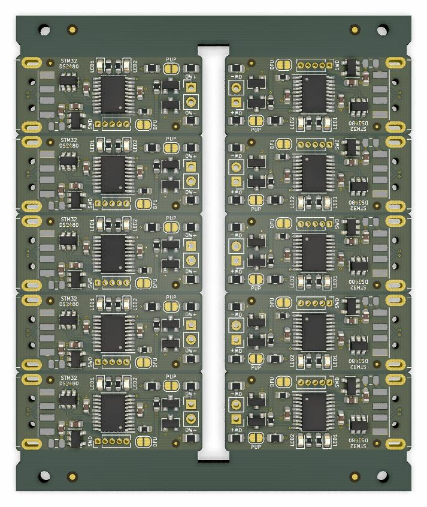

# STM32 DS2480 emulation project.
USB to 1-Wire line driver with STM32

# How to panelize PCB
1) Open panel tamplate
2) Save as panel
3) Append board and select stm32_ds2480_emu.kicad_pcb
4) Dublicate selection, rotate 180 degree and give 4mm spacing between two boards
5) Select boards and create an array (Count = 1 X 5 and Spacing = 0 X 14)
6) Move board array inside into the template
7) Set "Drill and Place Offset"
8) Export gerbers

# How to upload firmware
1) Download and install the DfuSe application from ST.
2) Solder "DFU" jumper and plug it into USB port.
3) Install driver if needed.
4) Run DfuSe and press "choose" button under "Update and verify action" section.
5) Locate to *.dfu file (software/stm32_ds2480_emu.dfu)
5) Press "Upgrade" button
6) Press "Leave DFU mode" button.
8) Remove solder from "DFU" jumper

